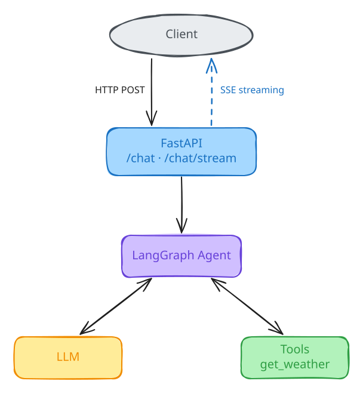
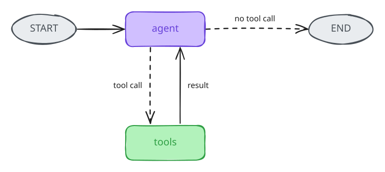

# LangGraph + FastAPI Example

Companion code for the Salada de Dados article
**"How to Build a Production-Ready LangGraph Agent with FastAPI"**.

A small, working base: a LangGraph agent with a **real tool**, served by FastAPI,
with a regular JSON endpoint and an **SSE streaming** endpoint.

It is intentionally *not* a full production architecture — see
[What this example intentionally leaves out](#what-this-example-does-not-do-yet).



## Quickstart

Requires Python 3.11+ and an API key from **one** LLM provider (Anthropic or OpenAI).

### 1. Install

```bash
git clone https://github.com/saladadedados/langgraph-fastapi-example.git
cd langgraph-fastapi-example

python -m venv .venv
source .venv/bin/activate        # Windows: .venv\Scripts\activate
pip install -r requirements.txt
```

### 2. Configure the model and API key

Create your `.env` from the example:

```bash
cp .env.example .env             # Windows: copy .env.example .env
```

Open `.env` and set **two things**: which model to use (`LLM_MODEL`) and the API key
for that model's provider. Pick one of the options below.

**Anthropic (Claude)**: get a key at [console.anthropic.com](https://console.anthropic.com/settings/keys)

```dotenv
LLM_MODEL=anthropic:claude-sonnet-5-5
ANTHROPIC_API_KEY=your-key
```

**OpenAI (GPT)**: get a key at [platform.openai.com](https://platform.openai.com/api-keys)

```dotenv
LLM_MODEL=openai:gpt-5
OPENAI_API_KEY=your-key
```

`LLM_MODEL` always follows the format `provider:model-name`. The provider prefix must
match the key you set: `anthropic:` reads `ANTHROPIC_API_KEY`, `openai:` reads `OPENAI_API_KEY`.

> `.env` is in `.gitignore`. Never commit it, since it holds your secret key.

### 3. Run

```bash
uvicorn app.main:app --reload
```

When you see `Uvicorn running on http://127.0.0.1:8000`, the API is up.

## Try it

### Option 1: in the browser (easiest)

Open http://localhost:8000/docs, expand `POST /chat`, click **Try it out**, paste this body and click **Execute**:

```json
{"message": "What is the weather like in Lisbon right now?"}
```

The answer should include the current temperature in Lisbon, which means the agent called the tool.

> The browser UI waits for the full response, so it doesn't show streaming. Use one of the options below for `/chat/stream`.

### Option 2: from the terminal (macOS / Linux / Git Bash)

```bash
# Health check
curl http://localhost:8000/health

# Regular request: waits for the full answer
curl -X POST http://localhost:8000/chat \
  -H "Content-Type: application/json" \
  -d '{"message": "What is the weather like in Lisbon right now?"}'

# Streaming request (SSE): tokens arrive as they are generated
curl -N -X POST http://localhost:8000/chat/stream \
  -H "Content-Type: application/json" \
  -d '{"message": "What is the weather like in Lisbon right now?"}'
```

### Option 3: from Windows PowerShell

```powershell
# Health check
Invoke-RestMethod http://localhost:8000/health

# Regular request
Invoke-RestMethod -Method Post -Uri http://localhost:8000/chat `
  -ContentType "application/json" `
  -Body '{"message": "What is the weather like in Lisbon right now?"}'

# Streaming request: use curl.exe (plain "curl" is a different command in PowerShell).
# The \" escapes are needed because Windows PowerShell 5.1 strips quotes passed to .exe files.
curl.exe -N -X POST http://localhost:8000/chat/stream `
  -H "Content-Type: application/json" `
  -d '{\"message\": \"What is the weather like in Lisbon right now?\"}'
```

### What to expect from the stream

Events arrive one by one: first `tool`, then many `token` events, then `done`.

| event   | data                         | when                          |
|---------|------------------------------|-------------------------------|
| `tool`  | `{"name": "get_weather"}`    | a tool finished running       |
| `token` | `{"content": "..."}`         | a piece of the answer arrived |
| `done`  | `{}`                         | the agent finished            |
| `error` | `{"detail": "..."}`          | something failed mid-stream   |

### Check the edge cases

| Try this                                        | Expected result                                                              |
|-------------------------------------------------|------------------------------------------------------------------------------|
| `{"message": ""}`                               | **422**: empty messages are rejected                                         |
| A message longer than `MAX_MESSAGE_LENGTH`      | **422**: rejected before reaching the LLM                                    |
| A wrong API key in `.env` (restart the server)  | **502** with a generic message; the full error shows only in the server logs |
| `{"message": "What is LangGraph?"}`             | An answer with no `tool` event: the agent only calls tools when needed       |

## How it works

```text
app/
├── agents/
│   ├── graph.py     # the tool, the LLM and the LangGraph graph
│   └── state.py     # graph state (the message list)
├── api/
│   └── chat.py      # POST /chat and POST /chat/stream
├── core/
│   └── config.py    # settings read from .env
└── main.py          # FastAPI app
```

The graph is a classic ReAct loop, written by hand so every step is visible:



- **agent**: calls the LLM with the conversation and the available tools.
- **tools**: runs whatever tool the LLM asked for and feeds the result back.
- **get_weather**: a real tool that calls the free [Open-Meteo](https://open-meteo.com/) API (no key needed).

> The diagrams were drawn with [Excalidraw](https://excalidraw.com). To edit them, open the
> `.excalidraw` files in [`docs/`](docs/) at excalidraw.com and export them again as SVG.

## Switching LLM providers

The model is a single `provider:model` string, resolved by LangChain's
[`init_chat_model`](https://python.langchain.com/docs/how_to/chat_models_universal_init/).
Switching providers is a `.env` change, with no code changes (see
[step 2 of the Quickstart](#2-configure-the-model-and-api-key)). Restart the server afterwards.

`langchain-anthropic` and `langchain-openai` are already in `requirements.txt`.
For other providers (Google, Mistral, Ollama…), install their LangChain integration
package and set the matching prefix and API key variable, e.g. `google_genai:` with `GOOGLE_API_KEY`.

## What this example intentionally leaves out

This repository focuses on the core integration pattern. **It runs, but don't deploy it as-is.**

It already includes two basic safeguards:

- Dependency versions are pinned in `requirements.txt`, so a fresh install gets the tested versions.
- User messages are capped at `MAX_MESSAGE_LENGTH` characters (default 4000), so a single request can't blow up your token bill.

Beyond that, a real application needs to consider the points below. They are listed
to help you plan, not as a checklist of features: the right solution for many of them
(authentication, rate limiting, secrets, observability) depends on your infrastructure
and use case.

### Before exposing it to the internet

These protect your API key and your wallet. Address them first:

| Missing                  | Why it matters                                                                                              |
|--------------------------|-------------------------------------------------------------------------------------------------------------|
| **Authentication**       | Anyone who finds the URL can call `/chat`, and every call spends tokens on *your* API key.                 |
| **Rate limiting**        | One client can fire thousands of requests, each one possibly triggering several LLM calls.                 |
| **Weather API licensing**| Open-Meteo's free API is for **non-commercial use only**. Commercial apps need their paid plan or another provider. |

### Before calling it production

| Missing                       | Why it matters in production                                                                    |
|-------------------------------|-------------------------------------------------------------------------------------------------|
| **Conversation memory**       | The graph has no checkpointer, so each request starts from zero. Real chats need a `thread_id` and LangGraph checkpointing. |
| **Persistence (PostgreSQL)**  | In-memory state is lost on restart and isn't shared across workers. A durable checkpointer fixes both. |
| **Docker / Compose**          | Reproducible builds and one-command environments for dev, CI and deploy.                       |
| **Tests**                     | Agents change behaviour when prompts, models or tools change. Tests with fake LLMs catch regressions. |
| **Structured error handling** | Here, errors become a generic 502 / `error` event. Production needs typed errors, retries and timeouts per dependency. |
| **Logging & tracing**         | Without them you can't answer "why did the agent do that?". Structured logs plus LangSmith/OpenTelemetry. |
| **Production configuration**  | Per-environment settings and running with multiple workers instead of `--reload`.              |
| **Secrets management & CORS** | API keys in a secrets manager rather than a `.env` file; CORS rules for browser clients on other domains. |
| **Full dependency lock**      | Only direct dependencies are pinned; transitive ones can still drift. Use a lock file (e.g. `uv lock`, `pip-tools`). |
| **Real health checks**        | `/health` says "ok" even if the LLM provider is down. Readiness checks should probe dependencies. |

## Want to skip the production boilerplate?

I'm building the **Production LangGraph + FastAPI Starter** — a
production-oriented version of this architecture with PostgreSQL
persistence, checkpointing, Docker, tests, structured error handling,
logging and production configuration.

It doesn't try to solve every point listed above. Authentication, rate limiting,
tracing and secrets management depend heavily on where and how you deploy, so they
stay your call.

**Planned launch price: $29**

[Get Early Access →](https://www.saladadedados.com/en/products/langgraph-fastapi-starter?utm_source=github&utm_medium=referral&utm_campaign=langgraph_starter)

*The knowledge is free. The product saves you the work.*
